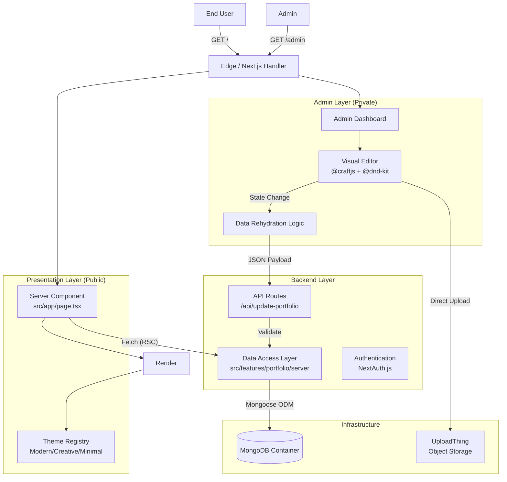
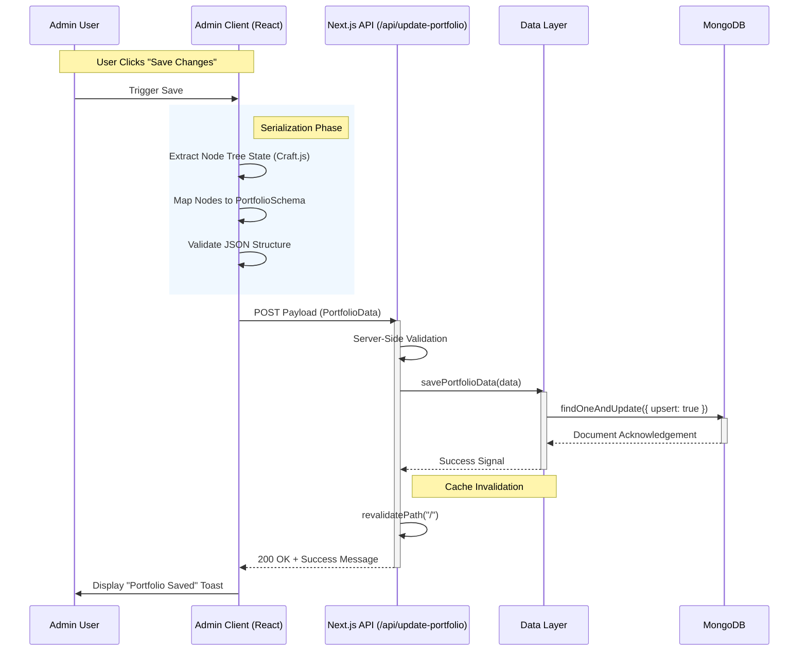

# Resfolio - Technical Whitepaper

**Resfolio** is a production-grade, full-stack portfolio builder engineered to generate dynamic, high-performance personal websites from structured user data. It functions as a dual-interface system: a **Server-Side Rendered (SSR) Public View** for SEO and performance, and a **Client-Side SPA Admin Dashboard** for interactive content management.

---

## 🏗️ System Architecture

Resfolio employs a decoupled architecture within the Next.js App Router framework, separating the Public Presentation Layer from the Admin Logic Layer while sharing a unified Data Access Layer (DAL).



### Core Components

1.  **Public Presentation Layer (`src/app/page.tsx`)**:
    *   **Rendering Strategy**: Utilizes `force-dynamic` Server Side Rendering (SSR) to ensure the portfolio always reflects the latest database state without client-side waterfalls.
    *   **Data Fetching**: Directly calls `getPortfolioData()` from the DAL, bypassing HTTP APIs for internal requests to maintain type safety and reduce latency.

2.  **Admin Logic Layer (`src/features/admin`)**:
    *   **State Management**: Built on `@craftjs/core` to represent the portfolio as a tree of serializable nodes.
    *   **Interactivity**: Integrates `@dnd-kit` for complex sortable interfaces (sections, items) and `LinkPopover` for inline metadata editing.
    *   **Rehydration**: Uses a custom utility to transform the Craft.js node tree back into the strict `PortfolioData` schema before persistence.

3.  **Data Access Layer (DAL)**:
    *   Located in `src/features/portfolio/server/data.ts`.
    *   Acts as the single source of truth for Mongoose interactions, abstracting DB logic from both API routes and React Server Components.

---

## 🔄 Sequence Diagrams

### 1. Data Persistence Workflow

The following diagram illustrates the lifecycle of a "Save" action triggered within the Admin Dashboard.



---

## 🛠️ Technology Stack & Library Justification

| Category | Technology | Purpose & Justification |
| :--- | :--- | :--- |
| **Framework** | **Next.js 16 (App Router)** | Provides Server Components for performance and Server Actions/API routes for backend logic in a unified codebase. |
| **Language** | **TypeScript** | Ensures strict type safety across the full stack, specifically for the complex `PortfolioData` interface and Mongoose models. |
| **Database** | **MongoDB + Mongoose** | chosen for its schema flexibility (handling variable resume sections) and ease of evolving the data model. |
| **Styling** | **Tailwind CSS v4** | delivering a zero-runtime styling engine with a utility-first approach for rapid UI iteration. |
| **Visual Editor** | **@craftjs/core** | A headless framework for building page builders. Enables the drag-and-drop implementation for the resume sections. |
| **Drag & Drop** | **@dnd-kit** | Used alongside Craft.js for granular sorting capabilities within lists (e.g., rearranging skills or experience items). |
| **PDF Handling** | **pdfjs-dist** | Enables client-side parsing of uploaded resumes to pre-fill portfolio data. |
| **File Storage** | **UploadThing** | Handles direct upload of profile images and resume PDFs to edge storage. |

---

## 📂 Module Communication

### Admin to Backend Handshake
The communication between the visual editor and the backend is critical. Unlike traditional forms, the editor maintains a complex state tree. 
*   **Transformation**: Before saving, the `editor-utils.ts` module traverses the Craft.js node tree. It extracts props from specific components (e.g., `EditableHero`, `SectionList`) and reconstructs the flat `PortfolioData` JSON object expected by the database.
*   **Validation**: The API route (`src/app/api/update-portfolio/route.ts`) performs a second pass of validation to ensure essential fields (personalInfo like Name/Email) are present before committing to MongoDB.

### Theme System
The project implements a **Registry Pattern** for themes.
*   The `PortfolioApp` component dynamically imports theme components (e.g., `features/portfolio/components/themes/modern`) based on the `theme` field in the data.
*   This allows for seamless switching between "Modern", "Classic", or "Creative" layouts without altering the underlying data structure.

---

## 🚀 Setup & Installation

### Prerequisites
*   Node.js v18+
*   MongoDB Instance (Local or Atlas)
*   UploadThing API Keys

### Quick Start

1.  **Clone & Install**
    ```bash
    git clone <repo_url>
    cd resfolio
    npm install
    ```

2.  **Environment Configuration**
    Create `.env.local` in the root:
    ```env
    MONGODB_URI=mongodb+srv://...
    NEXTAUTH_SECRET=your_secret
    UPLOADTHING_SECRET=ut_secret
    UPLOADTHING_APP_ID=ut_id
    ```

3.  **Run Development Server**
    ```bash
    npm run dev
    ```
    Access the app at `http://localhost:3000`.

4.  **Production Build**
    ```bash
    npm run build
    npm start
    ```