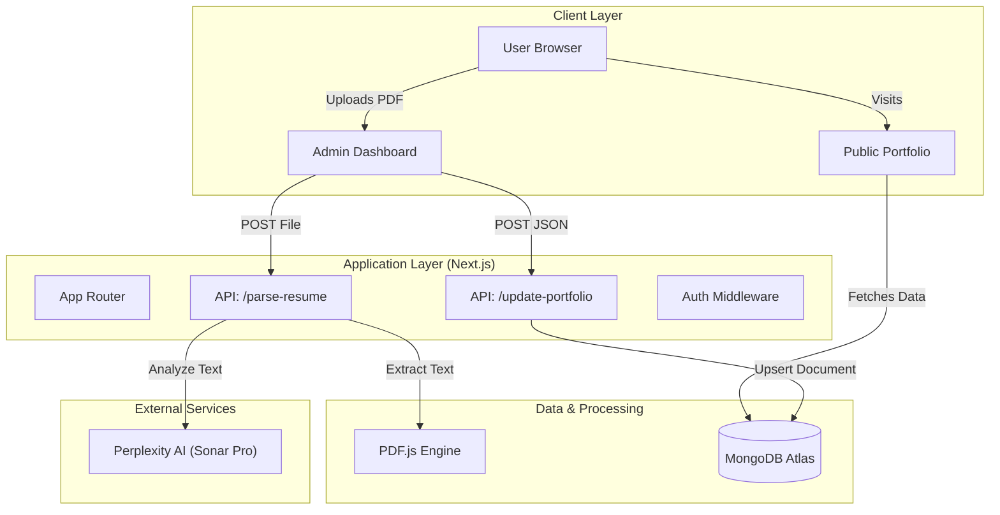
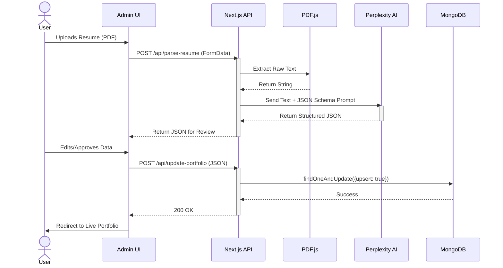

# Resfolio: AI-Powered Resume Portfolio Generator

**Resfolio** is a sophisticated, resume-driven portfolio generator that leverages Large Language Models (LLMs) to transform static PDF resumes into dynamic, multi-themed personal websites. Built with **Next.js 16**, it features a robust architecture designed for seamless data extraction, real-time preview, and persistent storage.

---

## ✨ Features

### 🤖 AI-Powered Resume Parsing
- **PDF Text Extraction**: Leverages `pdfjs-dist` to extract raw text from uploaded resumes
- **Intelligent Structuring**: Uses Perplexity AI (Sonar Pro) to intelligently parse and structure resume data into a comprehensive JSON schema
- **One-Click Import**: Transform your PDF resume into a fully editable portfolio in seconds

### ✏️ Real-Time Visual Editor
- **Craft.js Integration**: Built on [@craftjs/core](https://craft.js.org/) for drag-and-drop editing
- **Live Preview**: See changes instantly as you edit
- **Component Toolbox**: Drag-and-drop interface for adding sections:
  - Hero Section (Personal Info)
  - Experience
  - Projects
  - Skills
  - Education
  - Certifications
  - Publications
  - Achievements
  - Coursework
  - Extracurricular Activities
  - Custom Sections

### 🎯 Inline Editing
- **Click-to-Edit**: All text fields are directly editable on the canvas
- **Link Popover**: Edit social profile links (GitHub, LinkedIn, LeetCode, HackerRank, etc.) with a convenient popover interface
- **Floating Toolbar**: Context-aware toolbar for quick formatting and actions
- **Auto-Save**: Changes are automatically persisted to MongoDB

### 📋 Section Management
- **Drag-and-Drop Reordering**: Rearrange sections using [@dnd-kit](https://dndkit.com/)
- **Custom Section Titles**: Rename default section headers
- **Add/Remove Sections**: Dynamically add or remove portfolio sections
- **Persistent Layout**: Section order and titles are saved to the database

### 🎨 Multi-Theme Support
- **Modern Theme**: Contemporary design with vibrant colors and animations
- **Minimalist Theme**: Clean, professional layout
- **Creative Theme**: Bold, artistic presentation
- **Professional Theme**: Traditional, corporate-friendly design
- **Theme Switching**: Change themes without losing data

### 💾 Data Persistence
- **MongoDB Integration**: All portfolio data stored securely
- **Upsert Operations**: Seamless updates without data duplication
- **Real-Time Sync**: Changes reflected immediately on the live portfolio

---

## 🏗️ Architecture

The system follows a modern **Serverless/Edge-ready** architecture using the Next.js App Router. It separates concerns between the interactive frontend, the API layer for processing, and the database for persistence.



### Core Modules

1.  **Frontend (Client-Side)**:
    -   **Dynamic Rendering**: The public portfolio (`src/app/page.tsx`) fetches data server-side for SEO optimization.
    -   **Theme Engine**: A context-based theme switcher (`src/context/ThemeContext`) dynamically loads component sets (Modern, Minimalist, etc.) without page reloads.
    -   **Admin Dashboard**: A protected route (`/admin`) handling file uploads, JSON review, and manual data overrides.

2.  **Backend (API Routes)**:
    -   **Resume Parsing Service** (`/api/parse-resume`):
        -   Receives `multipart/form-data`.
        -   Uses `pdfjs-dist` (Legacy Build) to extract raw text from PDFs.
        -   Constructs a prompt for **Perplexity's Sonar Pro** model to structure the text into a strict JSON schema.
    -   **Data Persistence** (`/api/update-portfolio`):
        -   Validates and sanitizes the reviewed JSON.
        -   Performs an *upsert* operation on the MongoDB `Portfolio` collection, ensuring a single source of truth for the user.

3.  **Database (MongoDB)**:
    -   Uses **Mongoose** for schema validation.
    -   Stores a monolithic `PortfolioData` object containing nested arrays for Experience, Education, Projects, etc.

---

## 🔄 Logic Flow: Resume Parsing & Update

The core value proposition of Resfolio is its "Upload-to-Publish" pipeline. The following sequence diagram details the lifecycle of a resume update.



---

## 🛠️ Tech Stack

### Core Framework
-   **Next.js 16 (App Router)**: React framework for server-side rendering and API routes.
-   **TypeScript 5**: Strict type safety across the entire stack (Shared `PortfolioData` interfaces).
-   **React 19**: Component-based UI library.

### Styling & UI
-   **Tailwind CSS v4**: Utility-first styling.
-   **Framer Motion**: Complex animations (page transitions, scroll reveals).
-   **Lucide React**: Consistent icon set.

### Editor & Interactivity
-   **Craft.js**: Drag-and-drop page builder framework for React.
-   **@dnd-kit**: Modern drag-and-drop toolkit for section reordering.
-   **Lodash**: Utility library for data manipulation.
-   **use-debounce**: Performance optimization for real-time editing.

### Backend & Data
-   **MongoDB & Mongoose**: NoSQL database for flexible document storage.
-   **Perplexity API**: LLM provider for intelligent text parsing.
-   **PDF.js**: PDF parsing library.

---

## 🚀 Installation & Setup

### Prerequisites
-   **Node.js** v18+
-   **MongoDB** (Local or Atlas)
-   **Perplexity API Key** (for parsing features)

### 1. Clone & Install
```bash
git clone <repository-url>
cd Resfolio
npm install
```

### 2. Environment Configuration
Create a `.env.local` file in the root directory:

```bash
# Database
MONGODB_URI=mongodb+srv://<user>:<password>@cluster.mongodb.net/resfolio

# AI Service
PERPLEXITY_API_KEY=pplx-xxxxxxxxxxxxxxxxxxxxxxxxx

# Authentication (Optional/Future)
NEXTAUTH_SECRET=your-secret-key
```

### 3. Run Development Server
```bash
npm run dev
```
Access the app at `http://localhost:3000`.

### 4. Deploy
The application is optimized for deployment on **Vercel**.
```bash
npm run build
npm start
```

---

## 📂 Project Structure

```
src/
├── app/                    # Next.js App Router
│   ├── api/                # Backend API Routes
│   ├── admin/              # Admin Dashboard Page
│   └── page.tsx            # Main Portfolio Entry
├── features/               # Feature-based Architecture
│   ├── admin/              # Admin-specific components (Review Logic)
│   └── portfolio/          # Portfolio Themes & Components
│       ├── components/
│       │   └── themes/     # (Modern, Minimalist, Creative, Professional)
├── lib/                    # Core Utilities
│   ├── db.ts               # Database Connection
│   └── data.ts             # Data Fetching Logic
├── models/                 # Mongoose Models
└── types/                  # Shared TypeScript Interfaces
```